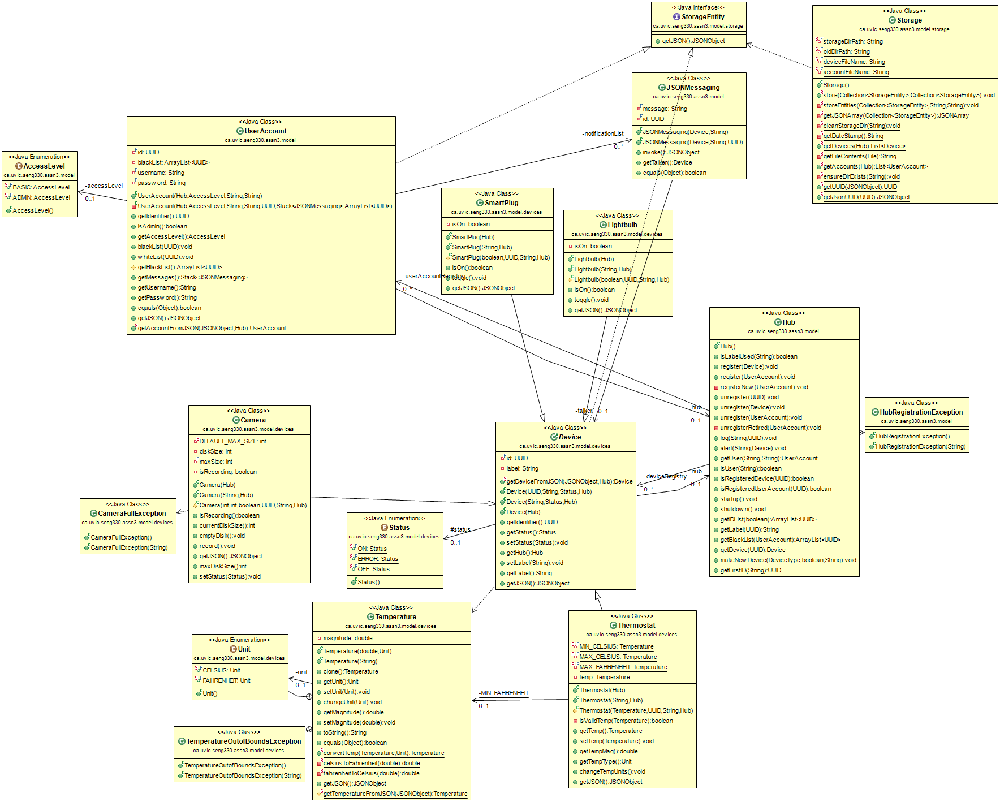
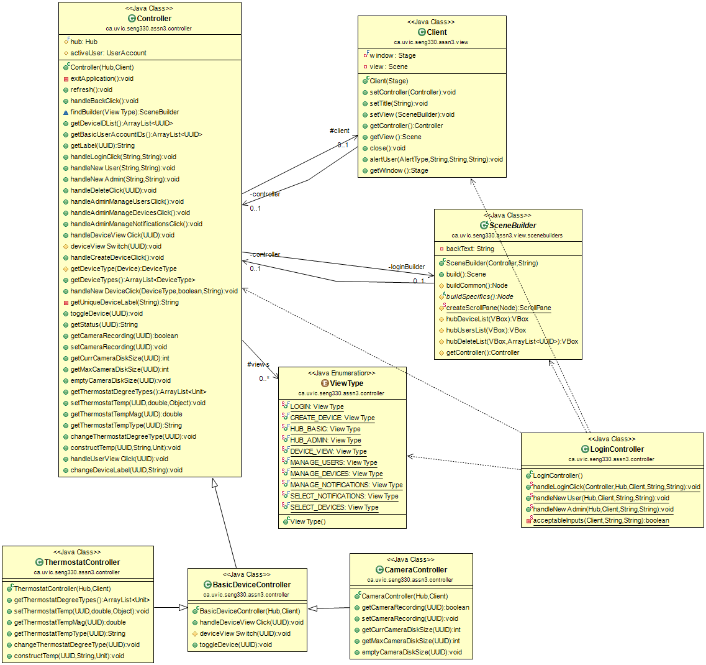

# A style document describing the development of our design decisions

## Model

The Model has been largely inherited from assignment two. Using Hub as our Primary EntryPoint, we can access all Devices and UserAccounts in our system. The Model is completely independant and does not rely on ANYTHING outside itself. Once we have completed a few flesh-outs and re-factors we will allow model to be observable (with a controller as the intended observer) to facilitate information flow and notification handling. This will also allow us to keep business logic primarily in the controller partition of the application.

### Hub

The Hub is the core of our model. It is responsible for registering and unregistering for all devices and UserAccounts in the system, and for holding aggregations and mappings of all entities currently in the system. It can also access almost any information about the objects it holds. This allows it to stay as the point of contact for Controller in most cases.

While the aspiration is for the Hub to be the only thing able to access that which it holds, it became unwieldly to continue that implementation. In an effort to avoid having a GODFUNCTION of a hub, we decided to implement getUser() and getDevice() so we could be more flexible in Controller, and seperate concerns more effectively.

Hub also acts as a mediator within the model, in that it is the go-between in nearly all communication between other model entities (UserAccounts and Devices, primarily). 

### UserAccount

UserAccount is responsible for knowing it's own accessLevel, which Hub it belongs to, it's username and password for verification, and it also holds the blacklist of devices it may not see.

We decided to have the UserAccounts store their own accessLevel and Device Blacklist so as to limit complexity of Hub. 

### Device

Device is an Abstract Class that is extended by all devices in the system. It holds the Hub it belongs to, its Label, Status and most importantly its UUID.

We use the UUID to do all important tasks in the system. Every time we want to get or change any device, the UUID is always part of the call. This assures us we can find the specific device we need and that we can't get our deviceTypes confused. 

#### Camera

Camera extends Device and is responsible for keeping track of if it is recording, the diskSize (space currently used) and if it is full or not.

#### Thermostat
	
Thermostat extends Device and is responsible for holding the Temperature, and making sure any new Temperatures are within acceptable limits for an average household. It allows conversion between the two commonly used degree systems.

#### Lightbulb & SmartPlug

Lightbulb & SmartPlug extend Device and are responsible for knowing if they are active or not.

### Storage

The Storage sub-package of model is repsonsible for converting all stateful entities within the model into a JSON representation, storing these entities  in a consistent system storage directory (consistency ensured by the storage package itself), recording previous system states in the event that an error occurs and the user would like to roll back the model to the last recorded state, and re-building the model (exactly as it was at shutdown) from the JSON representation.

### Model UML

## Controller

Controller is the middle man for View and Model. It currently has many responsibilities but we are planning to break it down into sub-controllers to make it not be a GODFUNCTION. These plans are described below.

At this time the Controller holds Model's Hub, and View's Client. It also knows who the ActiveUser is and has a Stack of ViewTypes so as to maintain an order of how the current screen was gotten to, facilitating backtracking.

We started with the controller just being a bridge from View to Model. But as we gave View more and more functionality, it necessitated Controller to grow. We have made inroads towards splitting the whole thing up by starting to segment the file into chunks described below.

### Handlers

For every button in our application we need a method to give it functionality. By and large these live in Controller. We keep the handlers in Controller so as to limit control flow complexity in View, and with an eye towards being able to refactor this into using the Observable pattern.

Putting our Handlers here also allows us to keep View and Model separate. As most of our buttons in View require us to access the Model, keeping large parts of the logic here lets us keep coupling loose.

### Public Utility Functions

Not all actions in View require us to access Model. Some only require the manipulation or accessing of things in controller: handleBackClick() or refresh() are examples of this.

Likewise, some functions which do access Model are used by most every ViewBuilder file. These are kept here as well for easy of access and to keep complexity and code duplication down.

### Specific Use Functions

Other functions however are very specific. these are things like the Thermostat specific getThermostatTempType() which are only used in a single View class. They are currently kept in Controller for ease of development, but have been segmented off with an eye for refactoring.

### FindBuilder

The Heart of Controller is FindBuilder(). This is used to maintain the View Stack for going backwards and also for creating the right screen going forward.

We decided to go with Dynamically generating each screen as we come to it so that:
* a) we don't need to save state anywhere, therein lowering space complexity and app launch overhead.
* b) ensuring that anything displayed at anytime will be accurate to the Model's current State.

FindBuilder() was echoed with deviceViewSwitch() to keep it clean code and to find the correct view to build for each Device Config Screen.

### Plans for the Refactor

The controller re-factor will focus on seperating all specific use functions (see above) into appropriate modules, and moving each of these functionality bundles into its own class, which will extend the Controller class which will contain all public utility functions. Necessitated by this modification will be a few changes to the interaction between View and Controller. Each Scene in View will have a corresponding Sub-Controller: a class which extends controller and thus contains all necessary public utility functionality as well as all specific use functions relevant to the view in questions. Some views will share a specialized controller. For example,  the AdminHub and BasicHub client views will both be controlled by a HubController.

### System UML

## View

### Client

Client is the class in view that serves as the point of contact for controller. It holds the Stage (window) used to house the GUI.

### SceneBuilder

SceneBuilder and its extensions serve as a simple, concise method to create any necessary view within the Client GUI. It makes use of the Template design pattern, where the buildCommon() method adds all Nodes common to all extensions of the class, while buildSpecifics() adds on the Nodes needed for the specific view being displayed. The build() method packages the results of buildCommon and buildSpecifics into a Scene object and returns this, ready to be displayed by Client. 

#### LoginView

Upon opening the application, the User is greeted by the LogIn screen. From this screen we can create new Accounts, Basic or Admin. We may then press the login button to go to HubView.

#### HubView

The HubView, much like Model's Hub, is the core of the application. It is from here that all other screens originate.

##### Basic

If the User logs in with a Basic UserAccount they are presented with a simple HubView. Consisting of all the Devices they're allowed to see. Selecting any of these will open the Device Config Screen for the specific Device.

##### Admin

If the User logs in with an Admin UserAccount they are presented with the same simple HubView as a Basic UserAccount, as well as the Admin Panel. Manage Users will let you go see a list of all non-Admin Users and either delete the UserAccount or see their Basic HubViews. In future an Admin User will be able to add Devices to the BlackList of any user in the list.

Manage Devices takes the User to a list of Devices in the system. Selecting any of these Devices will delete it from the System. Selecting the New Device Button will take the User to the Create Device screen where a new Device can be created of any available type (Any new DeviceTypes will automatically be added to the list). The Device will be given a default label or a custom one if specified. It can also be created in either the ON or OFF state.

Manage Notifications will in future allow the admin to dictate which devices will send notifications.

### DeviceSceneBuilder

The DeviceSceneBuilder class provides the basis for all the Device Config Screens. It is used to construct the basic functions common to all Device Screens. Such as relabeling and turning the device on and off.

#### CameraScene

Camera Scene allows for the Camera to start and stop recording when Device is ON. It also displays how full the diskSpace is. If the disk is full, the camera goes into an errored state.

#### ThermostatScene

Thermostat Scene displays current Temperature in the correct DegreeType and can be converted from CELSIUS to FAHRENHEIT and back. New temperatures can be made with either DegreeType but will reject any Temperatures that are out of bounds.

#### Lightbulb & SmartPlug

The remaining Devices only require the basic Device Functionality but have been given their own ViewBuilders for easy of future development. Dimmers or Meters come to mind.

### View Diagram

## Tests

### How to Run them

To build the project and start the application from the command line (at least on Jamie's machine!!) type `gradle run`

To run the test suite (including UI tests) from the command line (on Jamie's machine!!) type `gradle test`. 

Unfortunately, gradle does not play nicely with one of our UI tests (although it runs and passes as expected when run as a JUnit test from within Eclipse). Because of this, `gradle test` appears to hang up after a little while. Once this happens go ahead and force end the process with Control+C. Then you'll get the failure report. (PS, @The Marker, if you know why it works in eclipse but not when run from cmd, PLEASE let us know).
